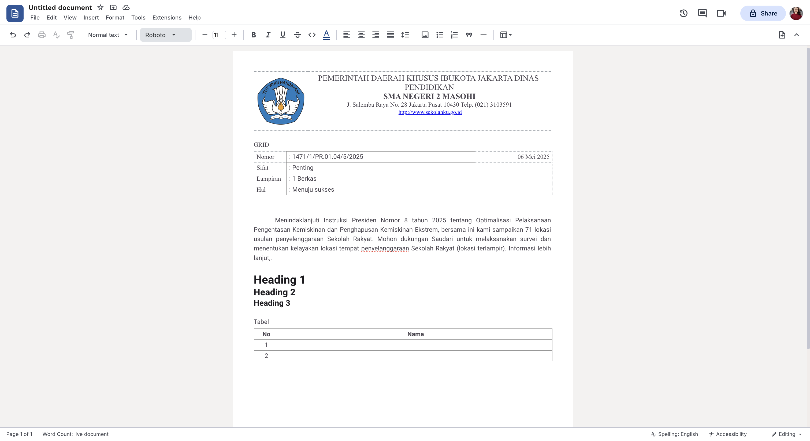

# tiptap-docs-kit

`tiptap-docs-kit` adalah extension kit untuk membangun editor dokumen berbasis Tiptap dengan pengalaman seperti word processor (mirip Google Docs / Microsoft Word). Package ini menggabungkan extension umum, halaman A4/Letter, page break, pagination, alignment, warna teks, ukuran font, line spacing, gambar, dan style dokumen dalam satu tempat.



## Demo

- Contoh penggunaan (playground React): https://github.com/zanwaar/playground-react

Jalankan demo secara lokal:

```bash
git clone https://github.com/zanwaar/playground-react
cd playground-react
npm install
npm run dev
```

## Fitur

- `DocsKit` sebagai satu extension bundle untuk editor dokumen.
- Page model seperti Word/Docs dengan node `page` (A4 & Letter, potret/lanskap).
- Pengaturan halaman: ukuran kertas, orientasi, dan margin (preset atau kustom per sisi dalam cm).
- Page break dengan node `pageBreak`.
- Pagination otomatis untuk menjaga konten antar halaman.
- Heading (1/2/3) dan Normal text.
- Text alignment untuk paragraph dan heading.
- Text color, text font, dan text size (berbasis `pt`).
- Line spacing (1, 1.15, 1.5, 2) plus spasi sebelum/sesudah paragraf.
- Gambar yang dapat di-resize (drag handle), mendukung base64.
- Table editing: insert, add/delete row/column, merge/split cell, resize column, dan grid.
- Table-aware pagination yang memecah tabel panjang per row dengan header berulang.
- Paragraf otomatis disisipkan di bawah tabel agar mudah lanjut menulis.
- CSS dokumen satu file lewat `tiptap-docs-kit/style.css`.
- Helper untuk membuat dokumen kosong dan template dokumen.

## Instalasi

Untuk local development di monorepo/playground:

```json
{
  "dependencies": {
    "tiptap-docs-kit": "file:../../packages/tiptap-docs-kit"
  }
}
```

Install dependency dari aplikasi consumer:

```bash
npm install
```

## Penggunaan React

```tsx
import { useEditor } from '@tiptap/react'
import { DocsKit, createBlankWordPageDocument } from 'tiptap-docs-kit'
import 'tiptap-docs-kit/style.css'

export function Editor() {
  const editor = useEditor({
    extensions: [DocsKit],
    content: createBlankWordPageDocument(),
    editorProps: {
      attributes: {
        class: 'word-editor-document',
      },
    },
  })

  return editor
}
```

## Pagination

Gunakan `bindWordPagePagination` pada container scroll editor.

```tsx
import { useEffect, useRef } from 'react'
import { EditorContent } from '@tiptap/react'
import type { Editor } from '@tiptap/react'
import { bindWordPagePagination } from 'tiptap-docs-kit'

export function Workspace({ editor }: { editor: Editor | null }) {
  const workspaceRef = useRef<HTMLElement>(null)

  useEffect(() => {
    if (!editor || !workspaceRef.current) return undefined

    return bindWordPagePagination(editor, workspaceRef.current)
  }, [editor])

  return (
    <main className="workspace" ref={workspaceRef}>
      <EditorContent editor={editor} />
    </main>
  )
}
```

## Commands

Package ini menambahkan beberapa command ke Tiptap.

### Page

```ts
editor.chain().focus().insertPage({ pageType: 'body' }).run()
editor.chain().focus().setPageAttrs({ paperSize: 'a4', orientation: 'portrait', margin: 'narrow' }).run()
editor.chain().focus().setPageAttrs({ marginValue: '2cm 1.5cm 1.5cm 1.5cm' }).run()
editor.chain().focus().insertPageBreak().run()
editor.chain().focus().insertWordPageTemplate('cover').run()
```

### Text Align

```ts
editor.chain().focus().setTextAlign('left').run()
editor.chain().focus().setTextAlign('center').run()
editor.chain().focus().setTextAlign('right').run()
editor.chain().focus().setTextAlign('justify').run()
```

### Text Color, Font, Size

```ts
editor.chain().focus().setTextColor('#063f81').run()
editor.chain().focus().unsetTextColor().run()
editor.chain().focus().setTextFont('Roboto, Arial, sans-serif').run()
editor.chain().focus().setTextSize('11pt').run()
```

### Line Spacing

```ts
editor.chain().focus().setLineSpacing('1.5').run()
editor.chain().focus().unsetLineSpacing().run()
editor.chain().focus().setParagraphSpaceBefore('12pt').run()
editor.chain().focus().setParagraphSpaceAfter('12pt').run()
```

### Image

```ts
// Disisipkan sebagai node image. Bisa base64 atau URL.
editor.chain().focus().insertContent({ type: 'image', attrs: { src, alt: 'Gambar' } }).run()
```

Gambar dapat di-resize dengan menarik handle di pojok kanan bawah. Lebar disimpan pada atribut `width` node image.

### Table

```ts
editor.chain().focus().insertTable({ rows: 3, cols: 3, withHeaderRow: true }).run()
editor.chain().focus().insertGrid({ rows: 4, cols: 4 }).run()
editor.chain().focus().addColumnAfter().run()
editor.chain().focus().addRowAfter().run()
editor.chain().focus().deleteColumn().run()
editor.chain().focus().deleteRow().run()
editor.chain().focus().deleteTable().run()
editor.chain().focus().mergeCells().run()
editor.chain().focus().splitCell().run()
```

Tabel panjang akan dipisah antar halaman pada batas row. Jika tabel memiliki header row, header akan diulang pada tabel lanjutan di halaman berikutnya.

## Konfigurasi DocsKit

`DocsKit` bisa dikonfigurasi per extension.

```ts
DocsKit.configure({
  starterKit: {},
  textAlign: { types: ['paragraph', 'heading'] },
  textColor: {},
  textFont: {},
  textSize: {},
  paragraphSpacing: { types: ['paragraph', 'heading'] },
  table: { resizable: true },
  tableCell: {},
  tableHeader: {},
  tableRow: {},
  page: { pasteAsPlainText: true },
  pageBreak: {},
  image: { inline: false, allowBase64: true },
})
```

Set salah satu opsi ke `false` untuk menonaktifkan extension tersebut.

```ts
DocsKit.configure({
  textColor: false,
})
```

## CSS

Import style sekali di aplikasi consumer:

```ts
import 'tiptap-docs-kit/style.css'
```

Style utama dikontrol melalui CSS variables:

```css
.word-editor-document {
  --word-page-width: 794px;
  --word-page-height: 1123px;
  --word-page-padding: 96px;
  --word-page-text-color: #49454f;
  --word-page-font-family: Roboto, Arial, sans-serif;
  --word-page-font-size: 11pt;
  --word-page-line-height: 1.15;
}
```

## Exports

```ts
import {
  DocsKit,
  Page,
  PageBreak,
  Table,
  TableCell,
  TableHeader,
  TableRow,
  TextAlign,
  TextColor,
  TextFont,
  TextSize,
  ParagraphSpacing,
  ResizableImage,
  bindWordPagePagination,
  mergeSplitWordParagraphs,
  normalizeWordPages,
  createBlankWordPageDocument,
  createWordPage,
  createWordPageDocument,
  createWordPageTemplate,
} from 'tiptap-docs-kit'
```

## Development

Jalankan dari folder package:

```bash
npm install
npm run build
npm run lint
```

Build akan menghasilkan output ke `dist/` dan menyalin `src/style.css` menjadi `dist/style.css`.

## Catatan Arsitektur

Package ini fokus pada logic Tiptap dan CSS dokumen. UI React seperti toolbar, status bar, sidebar, atau dialog color picker sebaiknya tetap berada di aplikasi consumer atau package React terpisah. Lihat contoh implementasi UI lengkap di https://github.com/zanwaar/playground-react.
